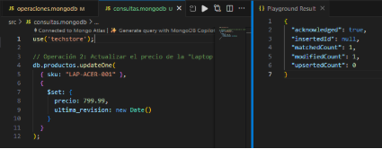

**Análisis Comparativo (SQL vs NoSQL)**

|**Criterio**|**Solución Relacional (SQL)** |**Solución NoSQL (MongoDB)**|**Justificación para "TechStore"**|
| :- | :- | :- | :- |
|**Flexibilidad de Esquema**|Rígido (requiere ALTER TABLE o tablas EAV).|Flexible (documentos JSON/BSON).|TechStore, al tener varios productos que contienen ciertas características específicas, ya no es necesario crear nuevos campos para cuando se requiera agregar una nueva especificación. Por ejemplo, si las laptops empiezan a venir con “huella dactilar” como método para iniciar, se puede agregar como un nuevo campo en los nuevos registros sin que los anteriores se vean afectados.|
|**Modelo de Datos**|Rígido (requiere ALTER TABLE o tablas EAV).|Tablas normalizadas (ej: productos, detalles\_laptop).|En TechStore, cada producto puede guardarse como un único documento con todas sus características o especificaciones, por lo que ya no es necesario crear tablas intermediarias para relacionarlas unas a otras.|
|**Consulta de Datos**|Requiere JOINs complejos para obtener detalles.|Consulta simple a un único documento.|En TechStore, las búsquedas de productos se realizan más rápido al acceder a un solo documento que ya contiene toda la información de cierto producto, a diferencia de una Base SQL con JOINs donde una vez encontrado cierto producto es necesario tener que buscar en otras tablas las demás características del mismo.|

**Diseño del Modelo Relacional**

Se realizó el siguiente Diagrama Entidad-Relación (DER) donde se contemplan las siguientes características:

1. Un cliente puede realizar varios pedidos, y un pedido específico solo puede estar disponible para un cliente (el cliente que creó el pedido).
1. Un pedido puede contener varios productos, pero el producto seleccionado solo puede estar para el cliente que lo seleccionó.
1. Un producto contiene varios detalles dependiendo del producto (laptop, móvil, monitor), y un detalle (ósea especificación) puede estar en varios productos.
1. Un producto puede tener varios proveedores, y un proveedor puede ofrecer varios productos.

**Diseño del Modelo NoSQL (MongoDB)**

A diferencia de un modelo relacional, en MongoDB los datos se almacenan como documentos JSON dentro de colecciones. Cada documento mantiene estructura flexible, lo cual permite que los productos de distintos tipos como las Laptops, los Smartphones, entre otros, incluyan distintos atributos sin necesidad de modificar el esquema general. A continuación, el esquema general para la estructura de los documentes de TechStore:

**// Colección: productos**

{

` `"\_id": "ObjectId(...)",

` `"nombre": "String",

` `"sku": "String (Indexado, Único)",

` `"precio": "Number",

` `"stock": "Number",

` `"tipo\_producto": "String (Enum: 'Laptop', 'Smartphone', 'Monitor')",

` `"fecha\_creacion": "Date",

` `"especificaciones": {

`          `// En este espacio irán todas las especificaciones dependiendo del producto que se ingrese

` `}

}

**Ejemplo 1: Producto tipo “Laptop”**

{ 

` `id": ObjectId("671eaa12b1d4e9c0f4a91234"), 

` `"nombre": "Laptop Acer Aspire 5", 

` `"sku": "LAP-ACER-001", 

` `"precio": 750.00, 

` `"stock": 10, 

` `"tipo\_producto": "Laptop", "fecha\_creacion": ISODate("2025-10-28T14:00:00Z"),

` `"especificaciones": { 

`       `"cpu": "Intel Core i7-1255U", 

`       `"ram\_gb": 16, 

`       `"almacenamiento": "512GB SSD", 

`       `pantalla": "15.6\" Full HD", 

`       `"sistema\_operativo": "Windows 11", 

`       `"dimensiones": { 

`           `"alto\_cm": 2.0, "ancho\_cm": 36.0, "peso\_kg": 1.7 

`       `} 

`   `} 

}

**Ejemplo 2: Producto tipo “Smartphone”**

{ 

` `"\_id": ObjectId("671eaa12b1d4e9c0f4a95678"), 

` `"nombre": "Samsung Galaxy S23", 

` `"sku": "SM-GALAXY-023", 

` `"precio": 899.99, 

` `"stock": 25, 

` `"tipo\_producto": "Smartphone", 

` `"fecha\_creacion": ISODate("2025-10-28T14:00:00Z"), 

` `"especificaciones": { 

`       `"pantalla": "6.1 AMOLED", 

`       `"resolucion": "2340x1080", 

`       `"ram\_gb": 8, 

`       `"almacenamiento": "256GB", 

`       `"bateria\_mAh": 3900, 

`       `"camara\_principal\_MP": 50, 

`       `"sistema\_operativo": "Android 14" 

`       `} 

}

**Resultados de la Ejecución**

1. Se creó la base de datos y se agregó un drop() para la limpieza inicial y poder ejecutar todo desde cero.

   

1. Se crearon los documentos a insertar dentro de la base de datos con la ayuda de un insertMany().

   

   Resultado de la inserción:

   

1. Se realizaron 4 consultas de lectura:

   

   -Resultado consulta #1: Mostrar todos los productos

   

   -Resultado consulta #2: Mostrar solo Laptops

   

   -Resultado consulta #3: Mostrar solo productos con stock > 10 y precio < 1000

   

   -Resultado consulta #4: Mostrar solo nombre, precio y stock de Smartphones

   

1. Actualización de datos.

   Operación 1: Se redujo el stock del smartphone.

   

   

   Operación 2: Se aumentó el precio de la laptop y se añadió un nuevo campo “ultima\_revision”.

   

   

1. **Análisis Reflexivo**

   **Pregunta 1: ¿Cuál fue la ventaja más significativa de usar un modelo de documento (MongoDB) para el caso "TechStore" en comparación con el modelo relacional que diseñó?** 

   No fue necesario crear distintas tablas para manejar la base de datos, por lo que no se necesita hacer cambios en la estructura, por eso basta con una sola colección donde se tienen todos los documentes con cada uno de los productos y sus respectivas características específicas.

   **Pregunta 2: ¿Cómo facilita el anidamiento de documentos (el campo especificaciones) la gestión de datos heterogéneos (diferentes atributos por producto)?**

   Es sencillo poder agregar las especificaciones (varias variables) de diferentes productos manteniendo l a estructura de la colección establecida, siendo que en una misma colección se puedan tener diferentes productos con características distintivas en sus especificaciones, como el Smartphone con la pantalla y la laptop con el CPU (tomando en cuenta los ejemplos establecidos).

   **Pregunta 3: ¿Qué problemas potenciales podría enfrentar esta base de datos a futuro si no se controla la flexibilidad del esquema (es decir, si se permite insertar cualquier dato)?** 

   Una flexibilidad sin control puede generar inconsistencias y pérdida en la validez de los datos. Si no se establecen reglas de validación, podrían aparecer documentos con campos mal escritos, tipos de datos diferentes o estructuras incompatibles entre productos del mismo tipo. Esto complicaría las consultas, mostrando información errónea o incluso generando errores.

   **Pregunta 4: ¿Qué paso técnico recomendaría a continuación para "profesionalizar" esta base de datos? (Piense en rendimiento e integridad de datos que no cubrimos en este laboratorio).**

   El siguiente paso técnico sería implementar validación de esquemas mediante JSON Schema en MongoDB para garantizar mantener la estructura establecida y consistencia de tipos. Además, también se podría crear índices sobre campos clave (sku, tipo\_producto, precio) para optimizar las consultas y el rendimiento de las consultas. 

